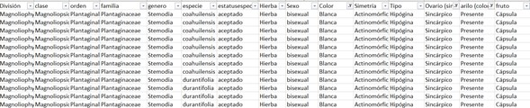
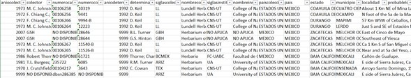

## Google slide presentation

# SUMMARIZED PRESENTATION
https://docs.google.com/presentation/d/19Q4eNH8t_CsoAeFHzM2Bzrm_UIttvSNt5JRDloUD7WU/edit?usp=sharing

# ORIGINAL PRESENTATION
https://docs.google.com/presentation/d/1G5hDVTpE9ugxiBCjYR5RUd0tgay0cveqQv3zAP6ep_s/edit#slide=id.p1 

## Project Presentation
In this project we'll do a **clustering job for Mexico's flora** by creating an unsupervised machine learning model. 
The main objective is to get different groups based on some features (altitude, latitude, family, color, type) in order to have a distinct plant classification, beyond the ones that already exist based in the ecosystem biodiversity.

With the model we are developing, we expect to help UNAM's (Universidad Nacional Autónoma de México) herbarium scientists predict the allocation of different plants based on some of their main characteristics and some environmental data. Besides there are some ecosystem classifications, with this project we are going to create groups in order to obtain different locations based on the variables we choose, this new groups, will help to make predictions about plant allocation and, with other models, find relationships and correlations between this flora data and fauna information.

For the development of the project, we are working with a database created inside the herbarium with Mexico's plant recollection data. By now, we are only working with the plant datapoints, which conform a database with about 173,000 rows with 63 columns. Next, an example of the data we are going to work with:

We expect to use some of the tools learned in order to solve some questions and create the corresponding deliverables.

From the database, we are going to create some queries in order to answer the following:

1.	How many families of plants are there?
2.	How many genus of plants are there?
3.	How many species of plants are there?
4.	Which families are the most diverse? Understanding the more diverse as the ones with more genus

With this information we are going to create a heatmap for the species quantity, in this map we will also include environmental layers as soil, precipitation and weather, just to mention a few. 

## Branches 
In order to work as a team we are using branches. With a Team of three people, we are using three branches. 

## Database 
The complete database includes 173,923 rows and 63 columns. Because we are working with an unsupervised model in order to solve a classification issue, we tried to have a balanced database getting proportional chunks of information, using the family and order columns as main filters.

The complete database includes 173,923 rows and 63 columns. For this first approach, a sample was taken, generating a new database of aprox 1000 rows and 10 columns. Because we are working with an unsupervised model in order to solve a classification issue, we tried to have a balanced database getting proportional chunks of information, using the family and order columns as main filters.

## Project Outline
### 1. Project selection
The project was selected by looking into possible areas where a machine learning model could be of use. Interestingly, a family member working in research showed interest in the project. This led us into the field of a mexican flora investigation (led by UNAM's scientists). A complex and extense database was available, so we knew we could help generate further discoveries with our model. 
(add mexican flora image)

### 2. Exploratory analysis of the data
This phase included the following steps which were performed in both Python and Rstudio.

* Statistical analysis of the data

* Exploration of trends

* Normality tests for each variable

* Correlation tests for every variable

* Search for null or empty values

* Search for duplicates

### 3. Preprocessing of the data
Once we had a clearer vision of how our data was arranged and how it all came together, we took on the task of cleaning the dataset. 
To do this we removed null values, removed variables that were not explicative enough, and grouped datapoints based on characteristics or ranges to reduce the size of the dataset. We also generated samples of the dataset. 
Lastly, we encoded categorical variables into numerical variables, and scaled the data. 

### 4. Machine Learning Model 
We the dataset cleaned and ready to use, we wrote the code to perform an unsupervised machine learning model for clustering of the information. 
The model was programmed in Python.
* We used PCA to reduce the model to 3 principal components.

* K-means method was used to get the ideal number of clusters for the model.

* Lastly, predictions were generated with the model.

### 5. Evaluation of the model's performance
To evaluate the model's performance at clustering, we will create a twin sample and compare the clustering results from both samples. 

### 6. Data interpretation, results and conclusions.
Once we confirm the ability of the model to cluster information correctly, we'll turn the numeric variables into categorical variables and add the new column ("class") to our dataframe, which will allow us to draw specific conclusions about the data.
